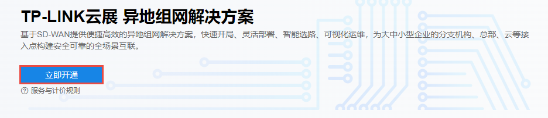
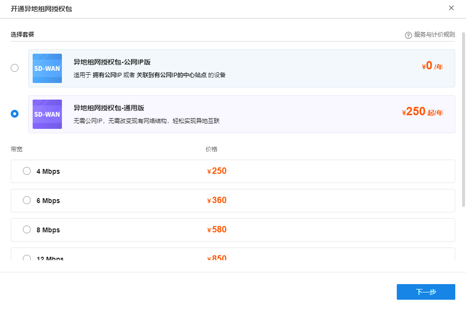
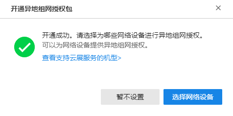
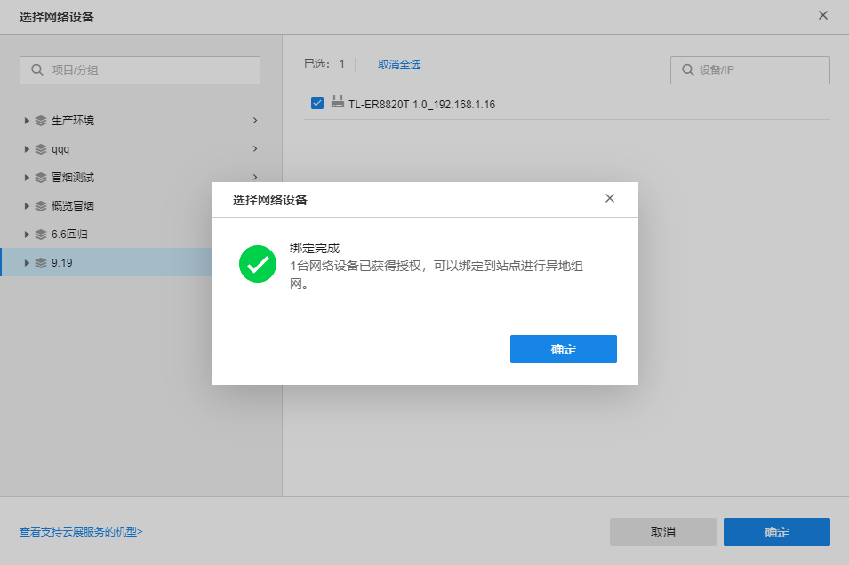

# 组网授权

**进入页面的方法：高级** **> >** **云展** **> >** **组网授权服务**

在此页面可开通异地组网授权服务，可以为拥有公网 IP 或关联到有公网 IP 的中心站点的设备进行授权。服务说明如下：

  1. 将设备添加到本平台

在 **设备** 页面，或 **项目 >> 设备管理** 页面，将需要异地组网的网络设备，提前添加到本平台。

  2. 开通异地组网授权服务

点击<立即开通>，根据需求选择公网 IP 版或通用版异地组网授权包，并选择相应的带宽。

|   
---|---  
异地组网授权包-公网 IP 版| 适用于拥有公网 IP 或者关联到有公网 IP 的中心站点的设备。  
异地组网授权包-通用版| 无需公网 IP、无需改变现有网络结构，轻松实现异地互联。实际价格按照套餐带宽规格及使用方式、授权设备数量和服务生效年限计算。  
  
  3. 为网络设备进行授权

开通服务或购买授权包后，点击<选择网络设备>，选择需要异地组网的网络设备进行授权（需选择步骤 1 中添加过的设备）。

> 说明：
> 
> 使用公网 IP 版授权包的设备与使用通用版授权包的设备之间无法互相通信，请按照实际组网需求进行设备授权和搭建拓扑。

  4. 配置网络

网络设备获得授权后，即可绑定到站点进行异地组网。如需进行站点配置，请前往页面：云展 >> 网络设计 >> 站点管理。

