# 网络监控

#### 站点监控

**进入页面的方法：高级** **> >** **云展** **> >** **网络监控** **> >** **站点监控**

站点监控可以了解云展系统的健康度状态和带宽利用率情况，展示告警消息，地图模式下站点信息，站点健康度，站点数据等情况，点击可查看详情：

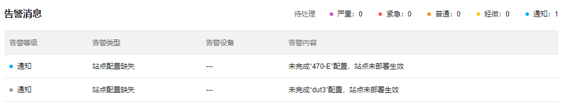

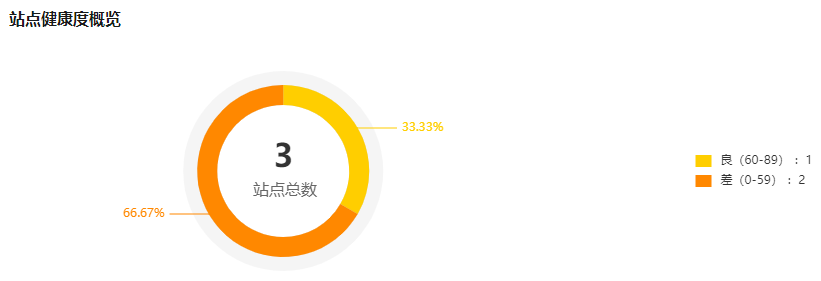

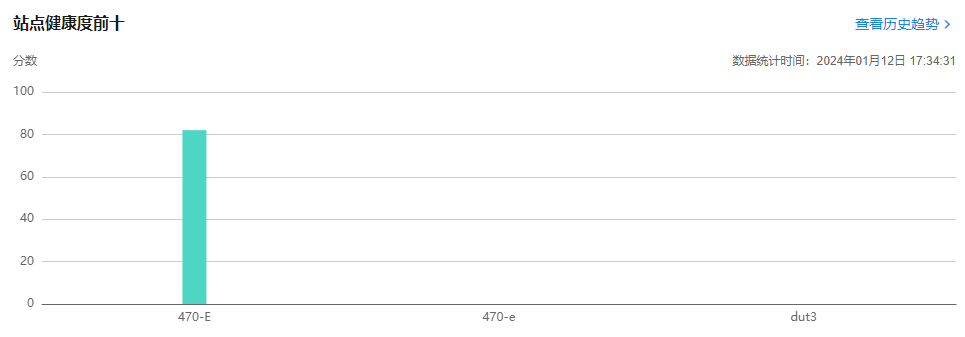

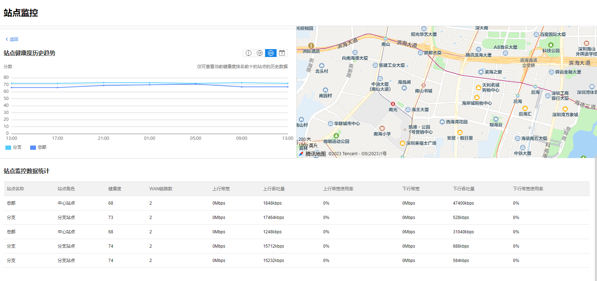

#### 链路监控

**进入页面的方法：高级** **> >** **云展** **> >** **网络监控** **> >** **链路监控**

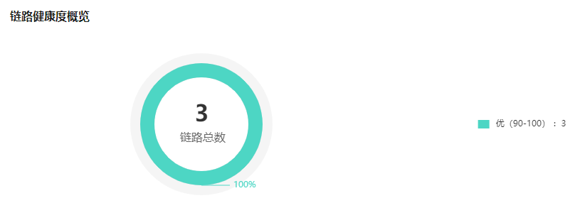

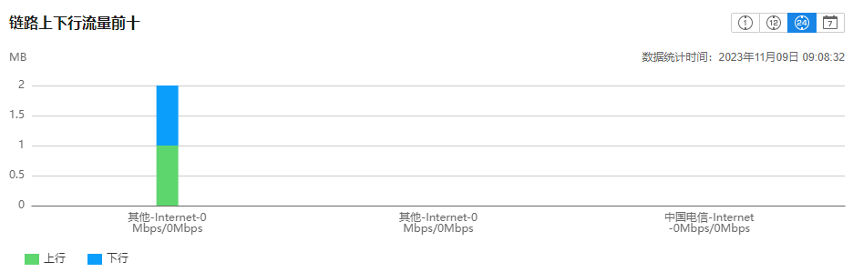

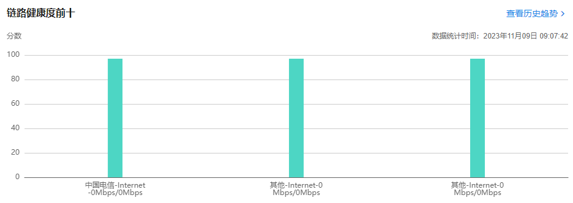

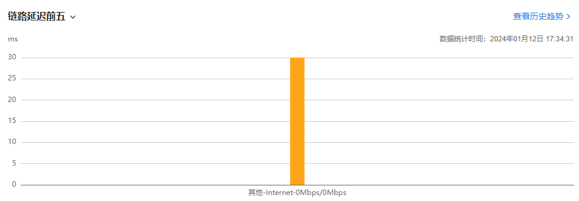

  * 链路监控数据统计：此页面显示链路的宽带利用率情况：

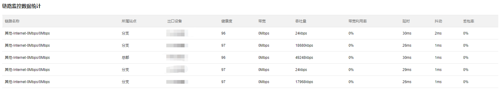

|   
---|---  
链路名称| 对应站点出口链路的名称，该名称用户可以自行修改。  
所属站点| 该链路所属的站点类型，总部站点或分支站点。  
出口设备| 该链路所属的出口设备名称。  
健康度| 系统综合评估该站点设备链路的健康度状态，高于 80 可以评估为健康。  
带宽| 该站点下的实际测试带宽值。  
吞吐量| 该站点链路上实时的数据吞吐量。  
带宽利用率| 该站点链路上实时的数据吞吐量占总带宽的百分比。  
延时/抖动/丢包率| 基于链路状态检测参数总体评估该链路的延时/抖动/丢包率情况。  
  
#### 设备监控

**进入页面的方法：高级** **> >** **云展** **> >** **网络监控** **> >** **设备监控**

  * 设备健康度

  * 设备 CPU 使用率前五

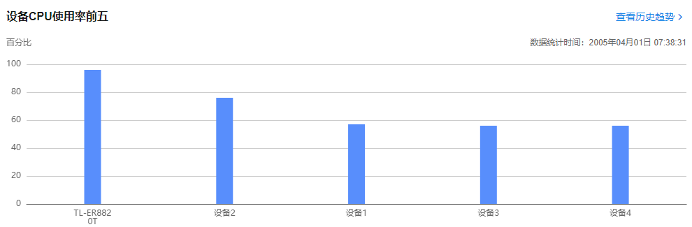

  * 设备 VPN 隧道使用率前五

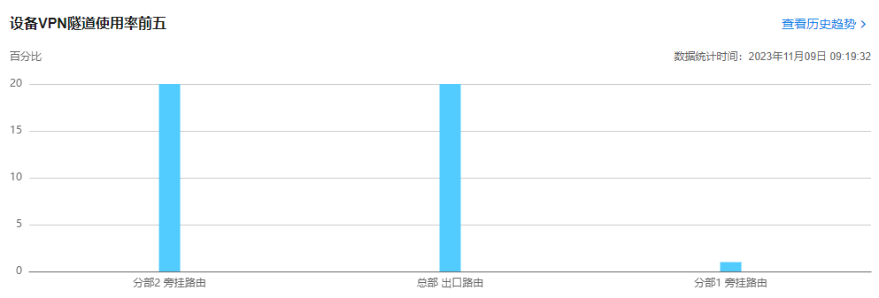

  * 设备内存使用率前五

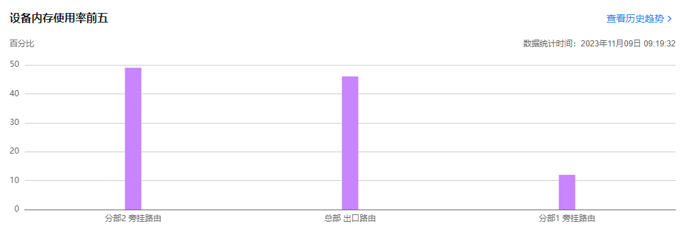

  * 设备 CPU 使用率前五：

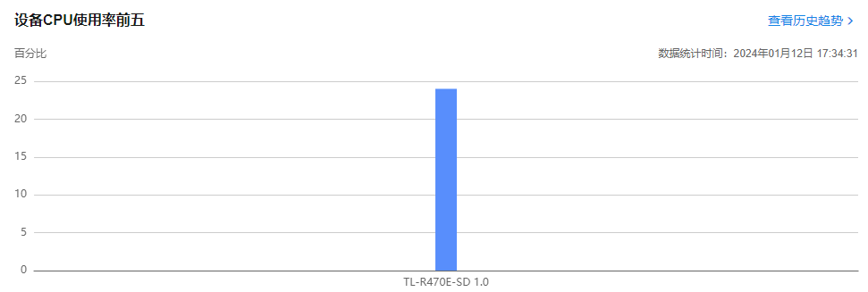

  * 设备监控数据统计：此页面显示站点设备的隧道利用率情况：

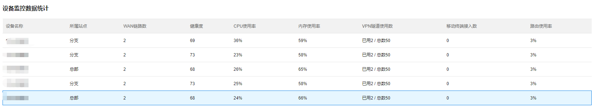

|   
---|---  
设备名称| 对应站点设备的名称，该名称用户可以自行修改。  
所属站点| 该链路所属的站点类型，总部站点或分支站点。  
WAN 链路数| 该站点的外网接口数目。  
健康度| 系统综合评估该站点设备的健康度状态，高于 80 可以评估为健康。  
CPU 使用率| 该站点下设备的平均 CPU 使用率。  
内存使用率| 该站点下设备的平均内存使用率。  
VPN 隧道使用数| 该站点 VPN 隧道使用数和规格总数。  
移动终端接入数| 显示该站点下通过移动终端接入 VPN 的数目。  
路由使用率| 整体评估路由器 VPN 性能使用率  
  
#### 告警监控

**进入页面的方法：高级** **> >** **云展** **> >** **网络监控** **> >** **告警监控**

该页面显示整个云展系统的所有告警信息，用户可以基于该页面进行相关运维维护：

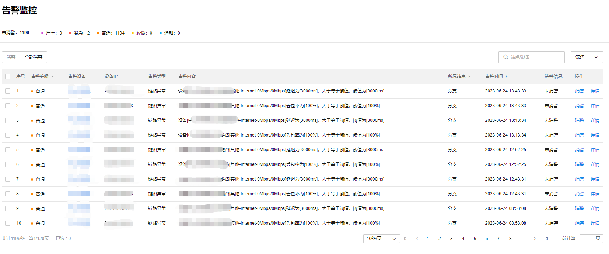

告警类型说明如下：

告警类型| 告警内容| 告警等级  
---|---|---  
IP 子网冲突| 子网段“XX”与站点“XX”中设备“XX”的子网段冲突，请修改| 严重  
链路异常| 设备“XX”出口链路“XX”延迟/抖动/丢包率为“XX”，高于阈值| 普通  
隧道异常| 与站点“XX”间无法连通| 紧急  
站点配置缺失| 未完成“XX”配置，站点未部署生效| 通知
