# 网络设计

#### 全局网络配置

**进入页面的方法：高级** **> >** **云展** **> >** **网络设计** **> >** **全局网络配置**

在此页面可以配置云展各设备的链路状态检测参数，用户判断链路的稳定性情况：

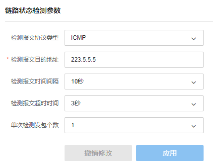

配置检测报文类型为 ICMP 或 DNS 检测，填写对应参数后点击<应用>保存配置，点击<撤销修改>回到上一次的配置内容。

|   
---|---  
检测报文协议类型| 配置云展设备检测报文的类型，目前支持 Ping 检测和 DNS 域名检测两种方式。  
检测报文目的地址| 检测报文的目的 IP 地址。  
检测报文时间间隔| 云展设备检测报文前后两次发送的时间间隔。  
检测报文超时时间| 云展设备检测报文发出到前端回复的时间间隔，如果大于超时时间判断检测失败。  
单次检测发包个数| 云展设备检测报文单次检测发送的报文数量。  
DNS 检测域名| 在云展设备检测报文配置为 DNS 检测时配置的检测域名地址。  
  
#### 站点管理

**进入页面的方法：高级** **> >** **云展** **> >** **网络设计** **> >** **站点管理**

站点管理可以在此页面配置云展的站点互联，本示例以 TL-R483G 5.0 设为中心站点，两个分部以 TL-R470-B 1.0 做出口路由，配置过程如下：

  1. 将三台设备连接网络并绑定商云平台；

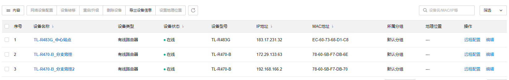

  2. 商云平台高级功能中开启云展功能，并添加站点；

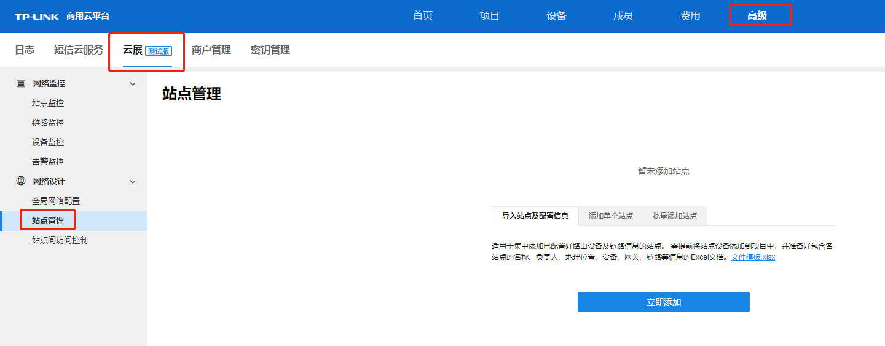

  3. 在站点管理页面添加中心站点 TL-R483G；

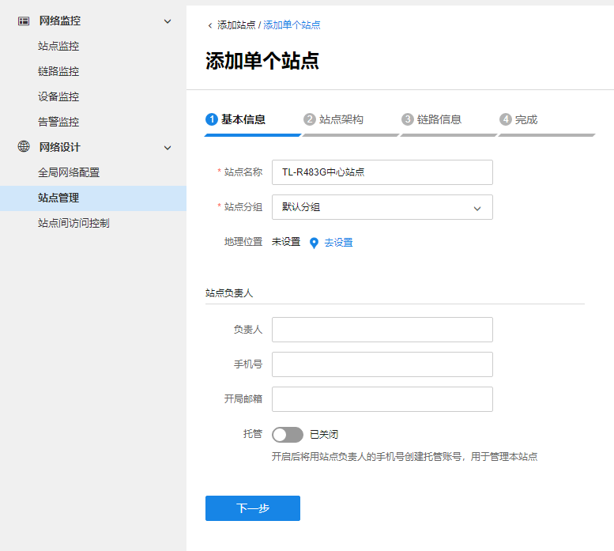

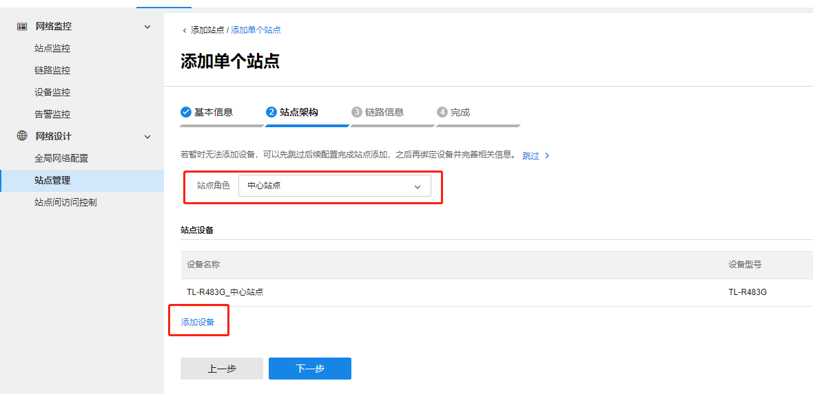

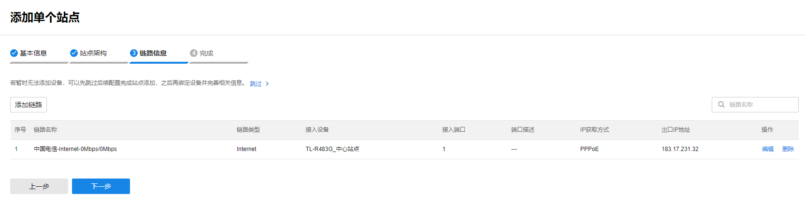

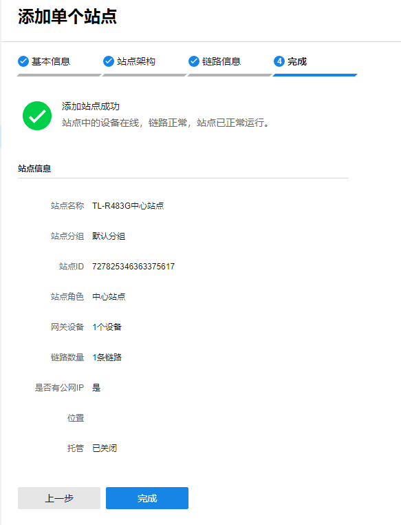

中心站点添加完成，下面开始添加分支站点。

  4. 继续在站点管理添加分支站点 1.2 设备 TL-R470-B，并绑定中心站点；

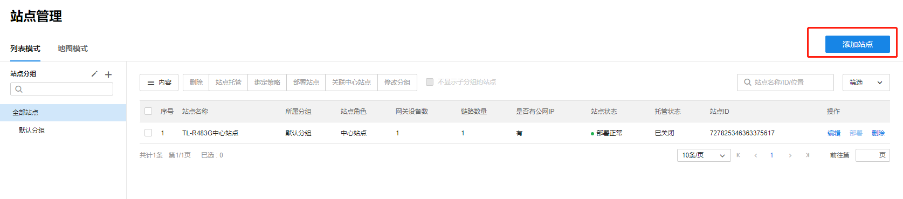

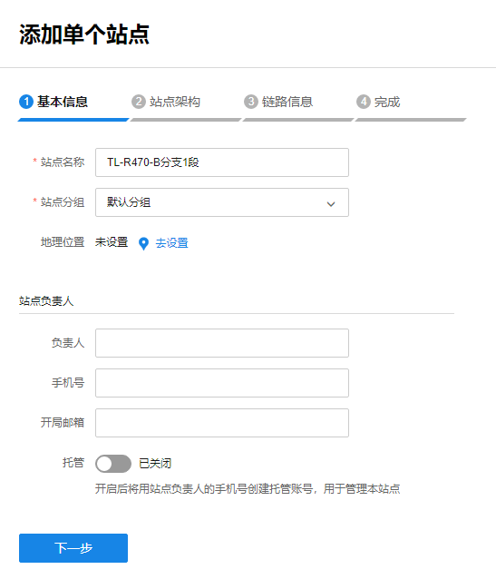

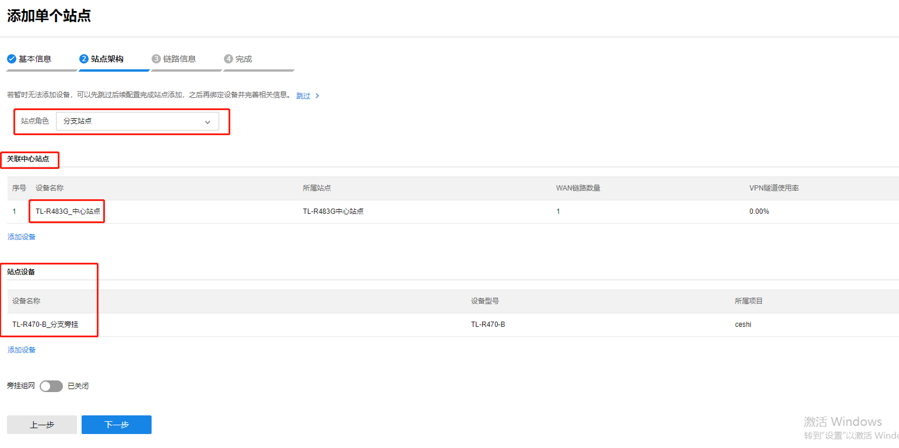

在列表模式中可查看添加完成的站点，设备端三个网段可以正常互访，并且可以通过云端控制互访。

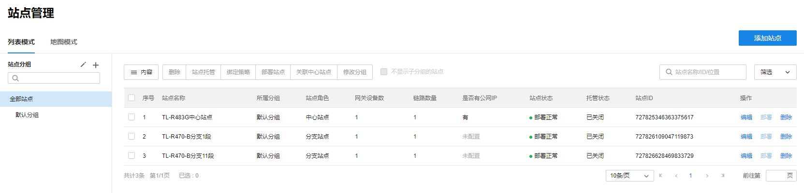

|   
---|---  
站点角色| 根据配置情况区分中心站点和分支站点。  
网关设备数| 对应站点链路下网关出口路由设备数量。  
链路数量| 出口路由器外网宽带数量。  
是否有公网 IP| 显示对应站点下是否有公网 IP 地址。  
站点状态| 站点所有的外网口都正常显示链路正常，如果存在一条宽带异常会显示链路异常。  
托管状态| 站点的托管状态，托管开启后对应的账号也可管理此站点。  
位置| 显示对应站点的实际地理位置，需要在配置站点时候说明。  
站点模式| 站点模式分列表模式和地图模式，列表模式下对应站点以列表形式展示，地图模式下站点按照实际的地理位置显示。  
  
在地图模式下，点击<管理地图及站点>可管理已添加的站点。

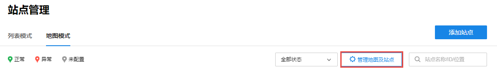

点击在地图上添加站点，添加后可在地图上查看站点状态（正常/异常/未配置）。

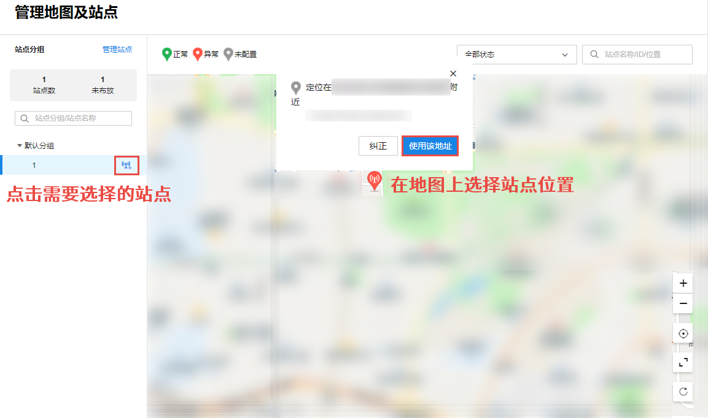

#### 站点间访问控制

**进入页面的方法：高级** **> >** **云展** **> >** **网络设计** **> >** **站点间访问控制**

云展隧道建立后默认所有站点所有网段间可以互通，对于有控制权限的场景可以在访问控制页面设置例外网段调整访问权限。

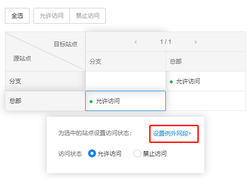

点击<设置例外网段>，可以在黑名单模式下限制源站点和目标站点间的禁止访问的网段：

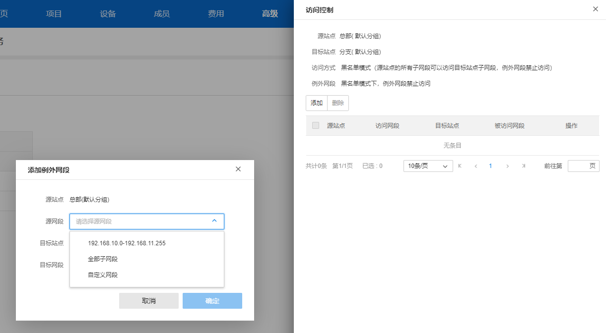

|   
---|---  
源站点| 数据包源 IP 所在的站点。  
源网段| 源站点中的某一个网段地址。  
目标站点| 数据包目的 IP 所在的站点。  
目标网段| 目标站点中的某一个网段地址。  
  
> 说明：
> 
> 访问方式 黑名单模式（源站点的所有子网段可以访问目标站点子网段，例外网段禁止访问）。
> 
> 例外网段 黑名单模式下，例外网段禁止访问。
