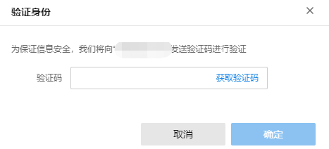
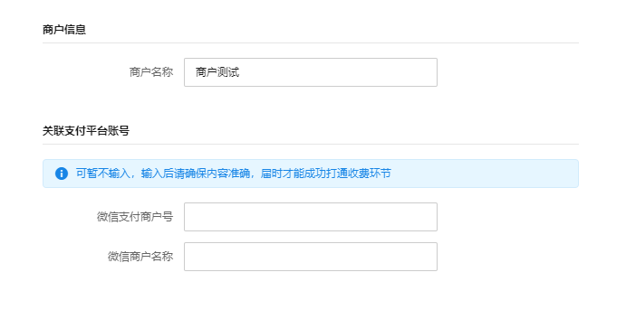
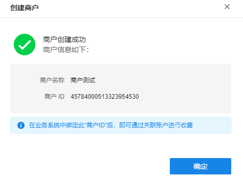
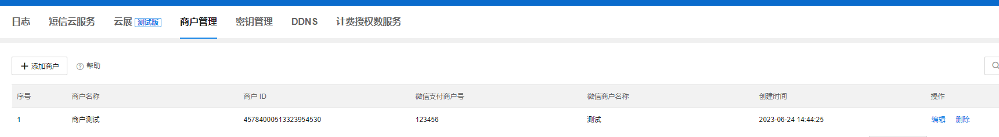
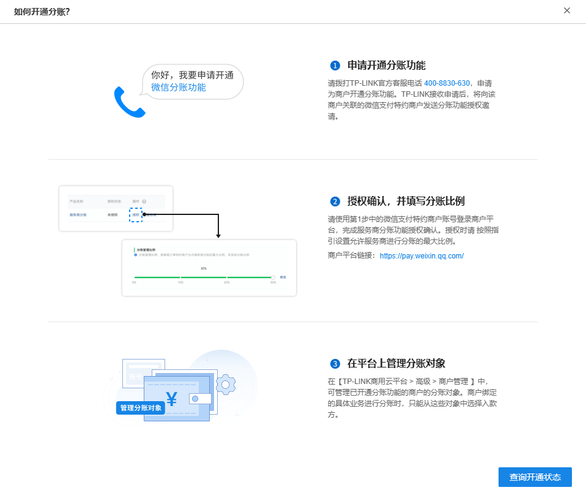

# 商户管理

TP-LINK 停⻋管理系统、新能源充电管理系统、 上网认证计费系统等业务平台，支持客户自定义收费规则，面向终端用户提供收费业务。为帮助客户快速完成业务系统的商户绑定、打通收费环节，TP-LINK 商用云平台提供商户管理功能，支持集中管理所有商户，可关联微信支付、 支付宝(即将支持)、银联(即将支持)等多个支付渠道的收费账号。

**进入页面的方法：高级** **> >** **商户管理**

使用 TP-LINK 商户集中管理之前，需要用户自行申请微信支付商户号，然后在本平台上创建新商户并绑定业务系统中。

> 说明：
> 
> 请拨打 TP-LINK 官方客服电话 400-8830-630 ，申请开通微信支付特约商户号。
> 
> 温馨提示： 自行申请的微信支付普通商户号无法使用 TP-LINK 商户服务。

如果已经成功申请微信支付特约商户号，则在本页面点击<立即创建商户>：

点击后 TP-LINK 会向此 TP-LINK ID 手机号发送验证码短信，点击<获取验证码>，收到验证码之后将验证码信息填入后点击<确认>，进行下一步操作：

验证码填写正确后需要输入商户信息并填写微信支付商户号：

商户创建成功后，后续在对应业务系统中绑定此商户 ID，则可关联账户进行收费。

如有分账的需求，也可按照提示申请开通分账功能并在微信商户平台进行配置。

