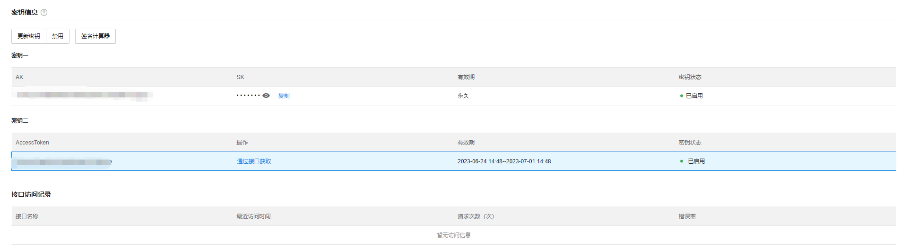

# 密钥管理

密钥是构建 API 请求的重要凭证，⽤于您调⽤商云接⼝时⽣成签名串；相关的签名算法⽂档请查看 TP-LINK 开放平台，您的 API 密钥代表您的 TP-LINK 账号身份，使⽤该密钥即可获取此账号下 TP-LINK 商云的所有资源；

**进入页面的方法：高级** **>** > **密钥管理**

启用了密钥功能后，API 对接需要填入该 AK 和 SK 信息，同时也可在这个页面查看接口访问记录：

> 说明：
> 
> 为了您的服务和财产安全，请妥善保存和定期更换密钥。请勿通过任何⽅式（如 Github）上传或分享您的密钥信息；
> 
> 使⽤ AK/SK，所有接⼝的调⽤都需要根据规则进⾏签名计算。该步骤较复杂，但 SK 不会通过⽹络传输，安全性较⾼。
> 
> 使⽤ AccessToken，在有效期内，凭此令牌即可调⽤接⼝。该⽅式更便捷，但安全性相⽐ AKSK 较低，存在 token 泄漏的⻛险。
