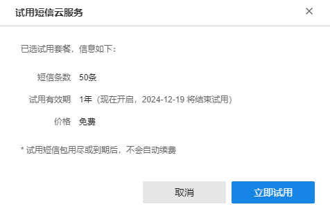

# 开通短信云服务

TP-LINK 短信云服务为⽤户提供短信认证服务，⽆线认证设备可直接对接 TP-LINK 短信云，配置简单、使⽤便捷，网终端通过短信验证码，完成⽆线上网认证。

#### 立即免费开通

**进入页面的方法：高级** > **短信云服务** **> >** **立即免费开通**

点击<立即免费开通>，点击<立即试用>，可以开通短信云服务功能。

短信云服务开通之后，可在详情页面查看服务状态、Access Key ID、Access Key Secret 等信息。

选定关联项目之后点击<开始配置>可以进行云短信认证相关设置流程，具体可参见下节短信云服务认证设置。如无需在此页面进行短信云认证相关设置，可点击<退出>，回到短信云服务详情页面。

|   
---|---  
服务状态| 显示短信云服务的开通和生效状态。  
Access Key ID| 短信云服务的唯一标识 ID，不可修改，在生效短信云服务时候需要填入此 ID。  
Access Key Secret| 短信云服务的准入密钥，可手动更新，在生效短信云服务时候需要填入此密钥。  
更新| 点击更新可以更新 Access Key Secret。  
  
> 说明：
> 
> Access Key Secret 可用于保障服务安全。
> 
> Access Key Secret 更新后，未绑定 TP-LINK 商云且配置过此短信云服务的认证设备，需重新配置 Access Key Secret 才能继续生效该服务。
