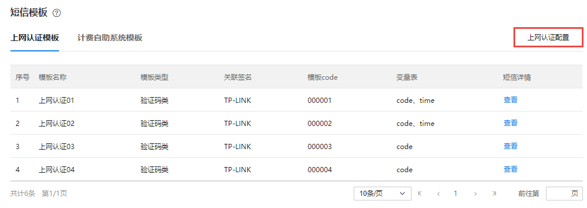
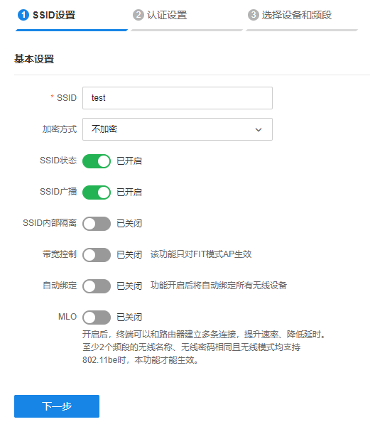
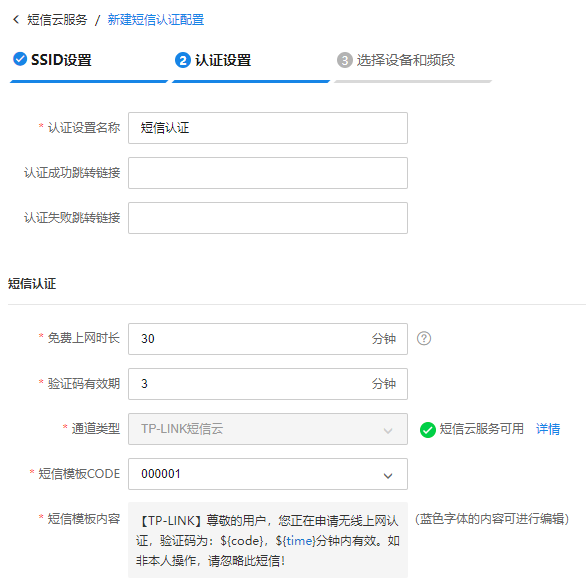
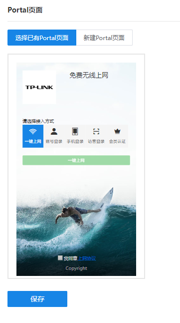
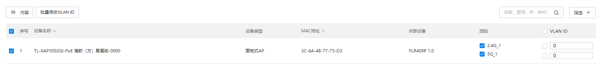

# 短信云服务认证设置

#### 生效短信云服务

**进入页面的方法：高级** **> >** **短信云服务** **> >** **短信模板** **> >** **上网认证模板**

点击<上网认证配置>，可以进入到短信认证配置页面。

  * **添加短信认证使用的 SSID**

在此页面点击<添加 SSID>添加短信认证使用的 SSID，并配置 SSID 的相关参数。

点击<下一步>，设置短信认证名称和短信认证相关参数：

在 Portal 页面选择短信认证所需的跳转页面，可选择已有的 Portal 页面和新建 Portal 页面:

选择 Portal 页面后点击<保存>，并点击<下一步>，进行无线设备选择：

点击<保存>完成添加。
