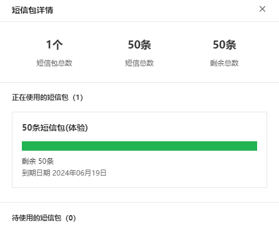
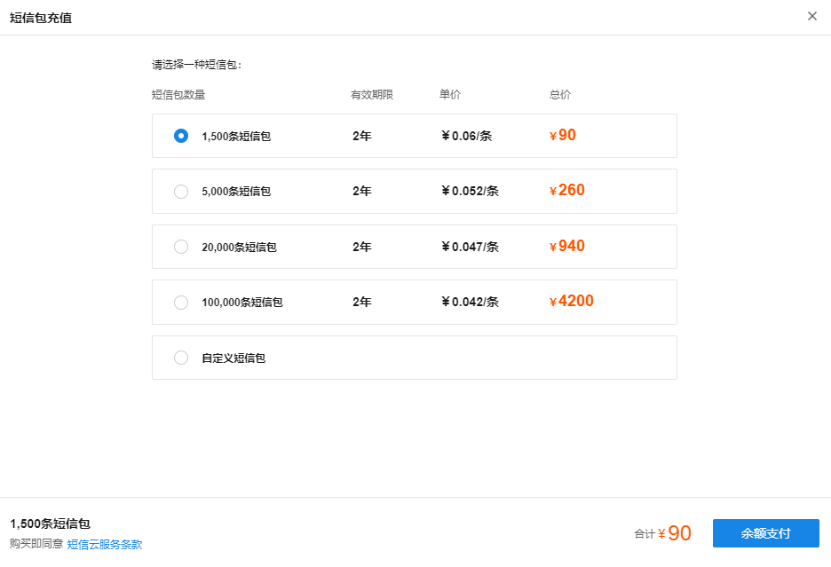

# 短信包详情

#### 短信包详情

**进入页面的方法：高级** **> >** **短信云服务** **> >** **短信包概况** **> >** **详情**

显示短信包的详细情况，点击<详情>页面，可以显示短信包总数，短信总数和剩余短信总数；其中分栏区分显示正在使用的短信包和待使用的短信包。

#### 短信包充值

**进入页面的方法：高级** **> >** **短信云服务** **> >** **短信包概况** **> >** **短信包充值**

点击<短信包充值>按钮，进入短信包充值页面，客户可根据实际短信使用量情况选择不同短信包进行充值：

选择短信包之后，点击<余额支付>，跳转支持页面，如果余额不足，需要在费用页面进行充值。
