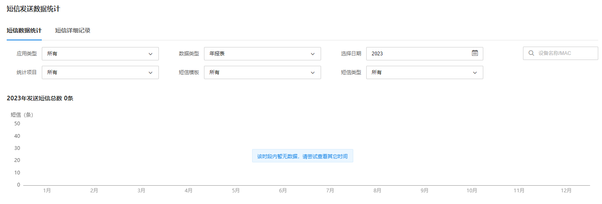
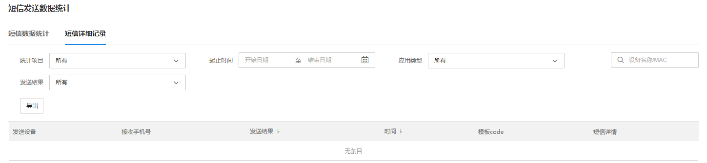

# 短信发送数据统计

#### 短信数据统计

**进入页面的方法：高级** **> >** **短信云服务** **> >** **短信发送数据统计**

该页面可以以月报表和年报表的形式展示短信发送的统计记录，方便运维人员查看相应的数据统计：

#### 短信详细记录

**进入页面的方法：高级 >> 短信云服务 >> 短信详细记录**

可根据统计项目、起止时间、应用类型和发送结果查询短信详细记录，方便运维人员查看相应信息：

