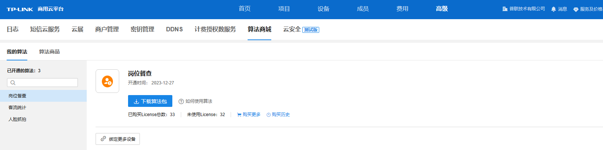
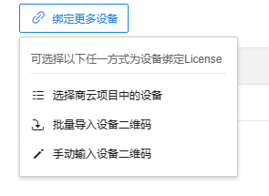
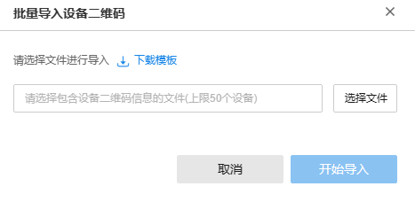
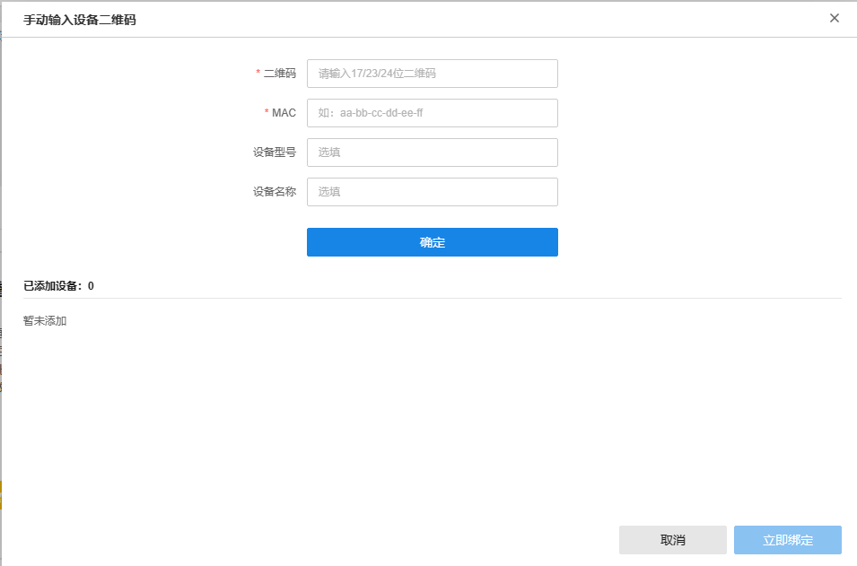
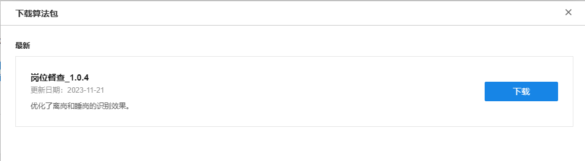

# 算法管理

**进入页面的方法** ：**高级 >> 算法商城 >> 我的算法**

可查看所有已采购的算法及算法绑定状态

|   
---|---  
下载算法包| 将对应算法安装包下载到本地  
绑定更多设备| 给所需设备授权算法  
购买更多| 对算法进行继续购买  
购买历史| 查看购买历史  
  
#### 算法授权

点击 <绑定更多设备”>进入购买界面。

  * 选择商云项目中的设备：可对已添加到商云中的设备进行选中并授权

  * 批量导入设备二维码：按照模板导入表格，可对设备进行批量授权， 主要用于对未添加到商云上的设备进行授权

  * 手动输入设备二维码：手动输入设备信息，可对单台设备进行授权， 主要用于对未添加到商云上的设备进行授权

#### 算法下载

点击<下载算法包>进入下载界面，点击 <下载>可将算法安装包下载至本地。

