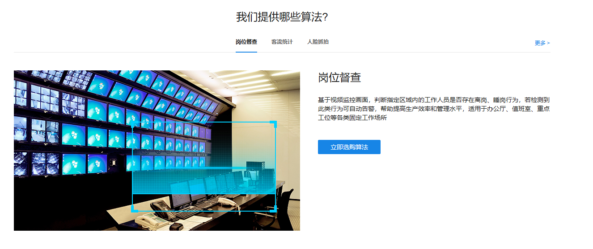
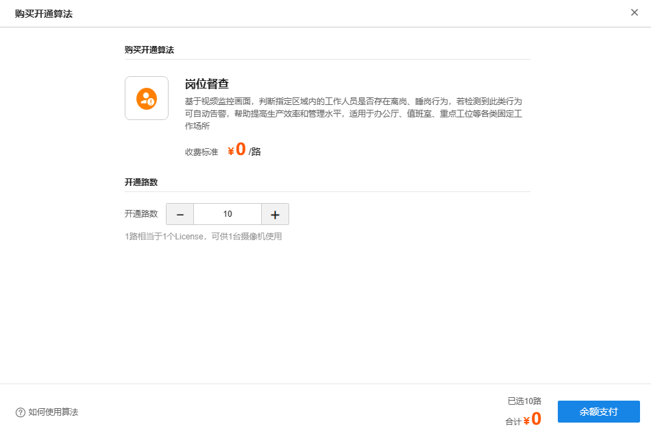
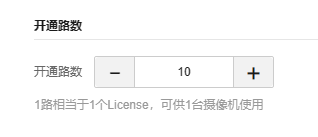
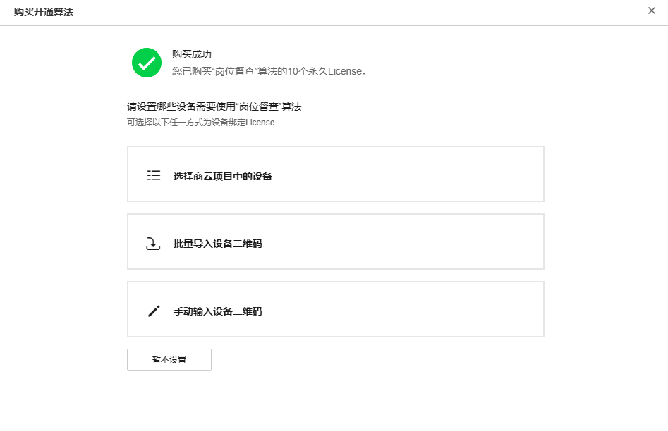
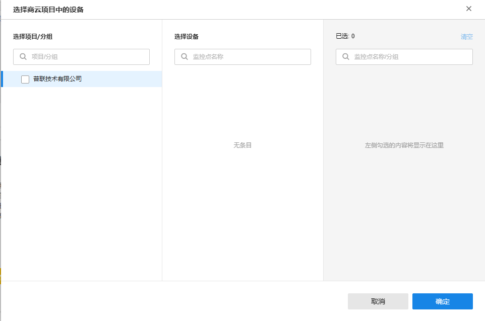
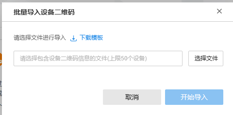

# 购买算法

#### 进入商城列表

**进入页面的方法：高级 >> 算法商城 >> 算法商品**

主界面显示所有 AI 算法列表，点击对应算法可查看算法相关介绍。

|   
---|---  
查询机型是否支持算法| 可输入算法名称和机型型号，查询是否可以进行适配安装。  
立即选购算法| 进入算法完整列表界面进行算法选购。  
更多| 进入算法完整列表界面。  
  
#### 购买算法

  1. 点击 “购买开通” 进入购买界面

  2. 选择需要开通的路数，点击<余额支付>。

其中 1 路相当于 1 个 License，可供 1 台摄像机使用。

  3. 购买成功后可选择不同方式对摄像机进行授权。

  * 选择商云项目中的设备：可对已添加到商云中的设备进行选中并授权

  * 批量导入设备二维码：按照模板导入表格，可对设备进行批量授权， 主要用于对未添加到商云上的设备进行授权

  * 手动输入设备二维码：手动输入设备信息，可对单台设备进行授权， 主要用于对未添加到商云上的设备进行授权

