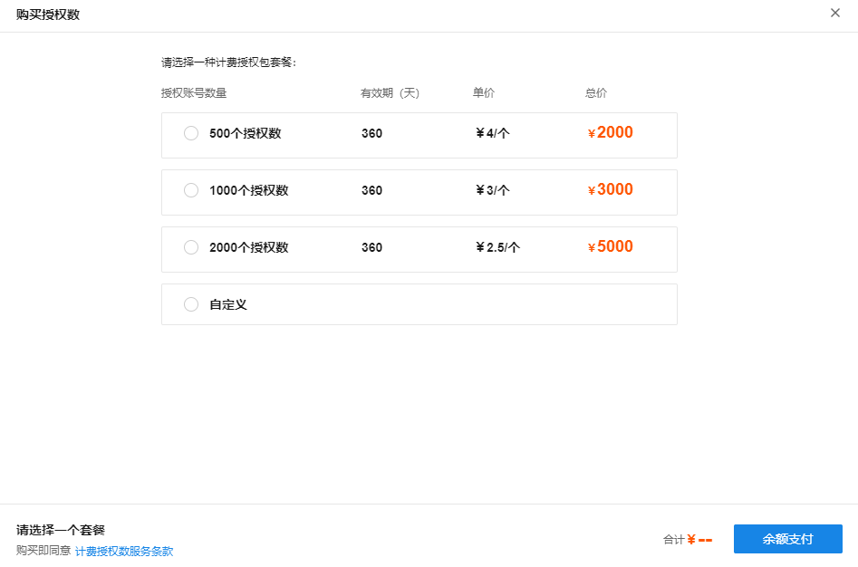
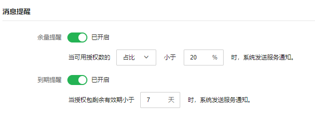
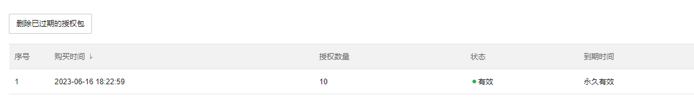

# 计费授权数服务

该页面显示 TP-LINK ID 下云认证功能支持的终端设备认证数量，默认免费永久授权包是 10 个授权数，也就是支持 10 台终端同时认证上线，如需更多终端认证授权，需要在本页面购买授权数。

**进入页面的方法：高级** > **计费授权数服务**

  * 购买授权数

点击<购买授权数>，根据需求购买授权个数，使用余额支付，如余额不足需先在费用页面进行充值：

  * 消息提醒

授权数可以开启余量提醒和到期提醒功能，防止因授权数不够或者到期导致云认证终端认证异常：

  * 授权包

此列表展示当前的所有授权包状态，包括购买时间，授权数量，当前状态和到期时间：

