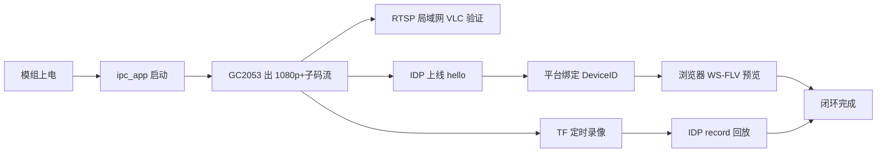

# 自研硬件基线冻结与文档排查报告（GK7205V200 + GC2053）

| 项目 | 内容 |
|---|---|
| 文档编号 | IPC-HW-BASELINE-001 |
| 版本 | v1.0 |
| 日期 | 2026-09-21 |
| 目的 | **冻结当前模组实机规格**，排查 PRD/固件/规格文档中的过时假设，给出「自研硬件闭环」最小路径 |
| 战略约束 | 先不对标 TUMS；**先把自有 IPC 样机跑通**（出流 → 上云 → 预览 → TF 回放） |
| 状态 | **实机规格 + 原理图已核对**（2026-09-21 补充 `G5V23-V1-原理图.pdf`，Hi3516EV200DMEB 同源 6 页）；镜头焦距、加密芯片型号（若非板载 EEPROM/扩展口）仍待补 |
| 原理图 | `D:\JetsCam\Source\国科微\G5V23-V1-原理图.pdf`（6 页；Power / SoC 模拟 / 接口 / Boot-Flash / 接插件 / Sensor-外设） |

---

## 1. 硬件基线（2026-09-21 冻结，以此为准）

| 项 | **实机规格** | 对文档的影响 |
|---|---|---|
| SoC | **国科微 GK7205V200**（海思 **HI3516EV200** 引脚 PIN 对 PIN 替代） | 与既有「量产 V200」一致；OpenIPC/MPP 按 EV200 兼容族 |
| Sensor | **GalaxyCore GC2053**，光学 **1/2.9"**，低照效果好 | **纠正 SC230AI**；2MP 级，主码流按 1080p 设计 |
| Flash | **16MB**（批量可换 **32MB**） | **纠正 128MB NAND 假设**；OTA/分区/控制台资源策略必须重算 |
| 网口 | **100M** 以太网 | 与 FE PHY 一致 |
| 电源 | **DC12V**，支持 **5–12V** 宽压 | 产品规格书项，固件不感知（可进外壳/电源说明） |
| USB | **1** 路（`USB_DM/DP`） | 调试/U 盘类外设 |
| PWM | 原理图 **PWM0、PWM1** 共 2 路（口述 1 路可用；PWM1 作 `LED_Ctrl`） | 红外灯调光用 PWM1 |
| RS485 | **预留**（未贴/未用） | PTZ/透传预留；R0 **不实现** RS485 协议 |
| 加密接口 | **1** 路（硬件安全元件） | 纠正「无硬加密」；IDP 设备证书/私钥优先走加密芯片 |
| TF 存储 | **可展板**贴装 TF 槽；**已安装 64GB TF 卡** | 录像/回放闭环不依赖 Flash 容量；16MB NOR 只放系统与应用 |
| DDR | 文档/芯片基线为 **V200 内置 64MB**；板级 boot 曾见 `mem=32M` 为 **Linux 可用划分**，不是总容量 | 预算仍按 64MB 芯片规格 + **以 `free`/`/proc/meminfo` 实测为准** |
| 音频 | **原理图确认有音频通路**：`AC_IN` + `AC_MICBIAS`（拾音）、`AC_OUT` / `AC_OUTL_REAR`（线路出） | **可做拾音 + 对讲下行**；能力位可开 `talk`，协议实现可后置 |
| WiFi | 清单无模组；**原理图亦无 WiFi** | **`network.wifi.enabled=false`** |
| 镜头 | 未列焦距；**有 IRCUT 电机驱** | 默认定焦 + **自动日夜 ICR** |
| 外接 ISP | 未列 | **SoC 内置 ISP**（GC2053 走 MIPI-2lane 进 SoC） |
| Flash 型号 | **U5 MX25L12835ZN**（128Mbit=**16MB** SPI NOR，8 脚） | 与 16MB 基线一致；Boot 默认 SPI NOR |
| 传感器供电 | **U7 BU12TD3WG（1.2V DVDD）+ U8 BU28TD3WG（2.8V）** | GC2053 专用 LDO，profile 不用写电源细节 |
| IRCUT | **U9 BA6208** 电机驱动 + `J4 CUTS`；注「驱动走线 ≥20mil」 | `gpio_map.ircut_*`；日夜切换硬件齐备 |
| 红外/白光灯 | `LED_Ctrl`（`GPIO1_0` / **PWM1**） | `ir_led` 用 PWM1，不是仅 PWM0 |
| 光敏 | **LSADC_CH0 / CH1**（片内光敏 ADC） | `light_sensor.adc=0/1` |
| 遥控 | `IR_IN`（`GPIO0_0` / `UPDATE_MODE` 复用） | R0 不做遥控解码，预留 |
| 485 | **U13 MAX485（可 NC）** + `485_CTRL`（经 Q 驱动）+ UART1 | 与「预留」一致：焊盘/器件位在，**协议栈 R0 不做** |
| 加密 | 原理图见 **U10 M24C02 EEPROM**（可选）；口述「加密接口×1」 | SE 芯片若在扩展口/另页需网表确认；驱动前 `hal_crypto` **文件 + EEPROM 回退** |
| 以太网 | 内置 FE PHY + 网变 **T1**，`LINK_LED`/`ACT_LED` | 100M |
| USB | `USB_DM/DP` 引出 | 1 路 |
| 存储卡 | **SDIO0** + `CARD_DETECT` + `SDIO_CARD_POWER_EN` | TF；**已插 64GB** |

```text
  12VIN ──TVS── FR9811/LP3202 ── 3V3 / 1V8 / CORE
                │
         GK7205V200（Hi3516EV200 PIN对PIN）
           │ MIPI-2lane+CK     │ FE PHY+T1      │ USB×1
           ▼                   ▼                │ UART0 调试
        GC2053              RJ45 100M          │ UART1+MAX485(可NC)
        1/2.9" 2MP          LINK/ACT LED       │ PWM0 / PWM1(LED_Ctrl)
        U7 1.2V + U8 2.8V                     │ LSADC 光敏
        U9 BA6208 → IRCUT(J4)                  │ IR_IN(复用)
           │
        SDIO0 TF 槽（可展板，已插 64GB）
        SFC SPI NOR U5 MX25L128 = 16MB（升配 32MB）
        I2C: U10 M24C02 EEPROM(可选) / 加密接口(待网表确认)
        音频: AC_IN+MICBIAS / AC_OUT+AC_OUTL_REAR
```

---

## 2. 文档排查矩阵（过时假设 → 处置）

| # | 文档 | 过时/矛盾内容 | 实机 | 严重度 | 处置 |
|---|---|---|---|---|---|
| 1 | `firmware/profiles/SP-R1-02.json` | `video.sensors: ["sc230ai"]` | **gc2053** | **阻断** | **已改** 为 `gc2053` |
| 2 | 同上 | `ota.slot_size_mb: 40` | 16MB 总 Flash **装不下双 40MB 槽** | **阻断** | **已改**：按 16MB 策略；见 §3 |
| 3 | 同上 | `network.wifi` 有 TBD 模组 + `wifi_power` GPIO | 本 SKU **无 WiFi 模组** | 高 | **已改** 关闭 WiFi |
| 4 | 同上 | `security.hw_secure: false` | 有 **加密接口** | 高 | **已改** `hw_secure: true`（驱动待接） |
| 5 | 同上 | 旧：音频未列 | **原理图有 AC_IN/OUT** | 中 | **已开** `audio.in/out` + `talk:true` |
| 6 | `SP-R1-02规格参数核对报告` | 全文 **SC230AI / 128MB NAND / 5MP** 争论 | GC2053 + 16MB NOR | **阻断（规格书）** | 核对基线改为 **GC2053**；Flash/OTA 章节重写；5MP 项维持删除 |
| 7 | `决策记录与待定事项` §2.2–2.3 | 芯片/传感器/Flash **全部待定** | 已可冻结多项 | 高 | **已改** 为「已冻结 / 仍待定」 |
| 8 | `MVP执行方案` / `私有协议方案` §4.1.4 | 默认 **WiFi ~3MB** 进预算；OTA 下载缓冲 ≥4MB | 无 WiFi 可省；16MB Flash OTA 缓冲策略变 | 中 | 预算重算：去掉 WiFi；OTA 改「边下边写 Flash」 |
| 9 | `IPC固件平台化架构` | 示例 sensor `sc230ai`；Flash 16MB 标「低配」 | 16MB 为 **量产默认**，32MB 为升配 | 中 | 架构仍有效；示例名过时，以 profile 为准 |
| 10 | `MVP-R0切片规格` | 「硬件不在 R0 冻结」 | 本报告 **给出 R0 硬件基线** | 低 | 闭环验收增加「真机 GC2053 出画」 |
| 11 | `gk_sys.c` / mock | mock `flash_total_kb=128*1024`；注释「无温度」 | 16MB Flash | 低 | mock 可后改；真机 `get_info` 读 MTD/partition |
| 12 | `gk_crypto.c` | 「无硬件安全存储」文件代替 | 有加密接口 | 中 | **保留文件回退**；有芯片时走 `hal_crypto` 硬件路径 |
| 13 | `gk_stub.c` video | 全 `HAL_ENOTSUP` | 需 **GC2053 出流** | **闭环阻断** | 下一里程碑：`hal_video` 真实现 |
| 14 | 平台 PRD / 接入规范 | 传感器/Flash 无细表 | — | 低 | 不改；硬件细节不进云 PRD |

**结论**：文档体系**结构可用**，但 **Sensor 与 Flash 两处基线错误**会直接导致调优资产找错、OTA 装不下、规格书无法签字。其余为预算与能力开关问题。

---

## 3. Flash 16MB 与 OTA 策略（必须改设计）

### 3.1 问题

| 旧假设 | 实机 |
|---|---|
| SPI NAND **128MB**，OTA A/B 双槽各 **40MB** | SPI NOR **16MB**（升配 32MB） |

16MB 物理上 **不可能** 双 40MB 槽；`profiles` 中 `ota.ab + slot_size_mb:40` 与板级 `spi_image` 单 rootfs 现状一致——量产必须换策略。

### 3.2 推荐分区（16MB 量产默认）

| 分区 | 建议大小 | 说明 |
|---|---|---|
| bootloader | 256–512KB | 现有 uboot |
| kernel (uImage) | 2.5–3.5MB | Linux 4.9.37 |
| rootfs (jffs2/ubifs) | 8–10MB | **含 `ipc_app` + 压缩控制台资源**；升级以 **整 rootfs 或 app 更新包** 为主 |
| config / sec | 256–512KB | 配置 + 加密芯片外的文件回退区（密钥优先在加密芯片） |
| recovery/预留 | 余量 | 失败回滚或日志 |

**32MB 升配**：可启用 **A/B rootfs 双槽**（各约 12–14MB），恢复体验更好；**同一固件源**，profile/`hal_sys` 按探测到的 Flash 容量选策略。

### 3.3 OTA 能力分级（写入能力位 `ota`）

| 级别 | Flash | 行为 | R0 闭环 |
|---|---|---|---|
| L0 串口/烧录器 | 16MB | 开发期刷机 | **足够跑通闭环** |
| L1 应用/整包单槽升级 | 16MB | 下载到 TF 或 tmp → 校验 → 写入 rootfs/app → 重启；**失败靠串口/本地恢复** | R0 建议做到「能远程刷」 |
| L2 A/B 无回滚风险 | **32MB** | 双槽 + `ota_confirm` | R1/量产升配 |

**明确**：16MB **不承诺** 无感 A/B；文档与销售口径禁止再写「40MB 双分区」。

### 3.4 控制台与协议体积

- 控制台继续 **gzip 嵌入**（`gen_assets.py` 方向正确）；16MB 下优先 **单页精简控制台**，完整云控由 IpcCloud 平台承担。
- 四协议并存时优先 **.so 按需加载**（接入方案裁剪顺序 ⑤），给 rootfs 留白。

---

## 4. 与 GC2053 相关的规格口径（规格书/PRD 对外）

| 项 | 建议对外写法 | 禁止写法 |
|---|---|---|
| 传感器 | GC2053，1/2.9" 2MP，低照优化 | SC230AI；1/2.7" |
| 有效像素 | 1920×1080 | 2880×1620 / 2592×1944 |
| 主码流 | 1920×1080，H.265/H.264 | 5MP / 3MP |
| 次码流 | 640×360 或 704×396 | 704×576 变形 4:3 |
| 宽动态 | 以 GC2053 + GK ISP 实测为准（默认「支持 WDR/低照」待测） | 写死 >100dB 不测 |
| 最低照度 | **样机实测**后写数（卖点：低照好） | 抄 SC230AI 的 0.05Lux |
| 对讲 | **支持拾音 + 音频出**（`AC_IN`/`AC_OUT`，外接喇叭/功放） | 无原理图依据时写「无音频」 |
| WiFi | **本版无**（以太网接入） | 写 802.11 |
| 安全 | **硬件加密接口** + 凭据保护 | 「无安全芯片」 |

---

## 5. 自研硬件闭环路径（先跑通，不扩 TUMS）

目标一句话：**样机上电 → 出 RTSP/IDP 流 → IpcCloud 首绑归属 → 浏览器预览 → TF 录像回放**（Reset 可夺回再绑）。



### 5.1 里程碑（建议 2–3 周）

| 序 | 工作 | 退出标准 | 依赖 |
|---|---|---|---|
| H1 | 文档/profile 按本报告对齐 | profile 校验过；决策记录无「芯片待定」 | **本报告** |
| H2 | `platform/gk7205v200` **video 真实现**（MPP/ISP + GC2053） | 双码流 24h 稳定；`ffprobe` 参数正确 | GOKE SDK / 驱动 |
| H3 | 局域网 RTSP | VLC/ZLM 拉主/子码流 | H2 |
| H4 | Flash 镜像可烧录 + `ipc_app` 自启 | 网页 ` /api/v1/system/info` 返回真机信息 | 现有控制台落地工作 |
| H5 | IDP 接入闭环 | hello/鉴权/心跳；平台列表 online | 证书进加密芯片或文件回退 |
| H6 | 平台预览 | h265web 首帧 ≤1.5s（局域网） | H5 + ZLM |
| H7 | TF 录像 + `record.query/play` | **64GB 卡**时间轴有段；循环覆盖/索引正确；拖动出画 | H2 + storage（**卡已就位**） |
| H8 | 加密芯片接入 | 私钥不可读导出；签名/随机可用 | 芯片型号/驱动 |
| H9 | 16MB 单槽升级包 | 远程升级一次成功（可串口兜底） | H4 |

**R0 闭环 = H1–H7**；H8/H9 可并行，不阻塞首次「能看能回放」。  
**录像依赖已解除**：TF 槽经可展板贴装且 **64GB 卡已装**，H7 可直接开测（建议 exFAT；定时/事件录像 ≥72h）。

### 5.2 立刻可做的代码/配置动作

1. 使用已改 `SP-R1-02.json`（gc2053 / 无 WiFi / hw_secure / 16MB OTA 策略）。  
2. `gk_stub.c` 的 `v_probe_sensor` 返回 `gc2053`；`hal_video` 按 MPP 实现。  
3. `gk_crypto.c`：保留文件回退，增加加密芯片分支（型号确认后）。  
4. 镜像脚本按 §3.2 分区；**删除 40MB slot 文档表述**。  
5. 真机 `free` 记入《SP-R1-02》实测表（区分「芯片 64MB」与「Linux 可用」）。

---

## 6. 仍待硬件补全（不阻塞 H1–H5）

| 项 | 为何还要 | 建议 |
|---|---|---|
| 加密芯片/接口确切器件（原理图见 M24C02；口述加密接口待网表） | 驱动与证书灌装 | 未定则 H5 文件证书 + EEPROM 可选 |
| 音频输入有无 / 功放 | 是否保留 MIC 产品点 | 无则规格书删音频 |
| 镜头定焦焦距（2.8/4/6mm） | 最低照度与 FOV 标称 | BOM 表 |
| 外接 ISP 有无 | 调优资产归属 | 模组原理图一栏 |
| TF 卡槽是否贴装 / 最大容量 | ~~录像闭环~~ **已确认（2026-09-21）**：经**可展板**贴装 TF 槽，**已插 64GB TF 卡** | 录像闭环可用；量产标称容量仍以实测/供应商为准 |
| PWM 占用（IR LED vs 其他） | `gpio_map` 引脚号 | 原理图网表 |
| RS485 是否预留电平芯片 | 仅预留焊盘则 PTZ 不做 | R0 忽略 |

---

## 7. 回写清单（本报告落地时已/应修改）

| 文件 | 动作 |
|---|---|
| `firmware/profiles/SP-R1-02.json` | **已更新**：gc2053、16MB OTA 策略、关 WiFi、hw_secure |
| `Docs/PRD/决策记录与待定事项.md` | **应更新** §2.2–2.3 冻结项 |
| `Docs/PRD/SP-R1-02规格参数核对报告.md` | 下一版改基线为 GC2053 + 16MB NOR（本报告可作附录） |
| `Docs/PRD/MVP-R0切片规格_一页纸.md` | 验收剧本增加「真机 GC2053 出画」 |
| `firmware/platform/gk7205v200/*` | H2 起实现 video；crypto 加 SE 分支 |
| 核对报告 §4 建议稿 / 对外规格书 | 按 §4 口径改传感器与 Flash |

---

**一句话**：硬件已经能定基线了——**GK7205V200 + GC2053 + 16MB NOR + 硬件加密口**；文档里最大的坑是 **传感器写错** 和 **Flash/OTA 按 128MB 假设设计**。先改 profile 与规格口径，再按 H1–H7 把自研机闭环跑通，TUMS 对标放到闭环之后。
