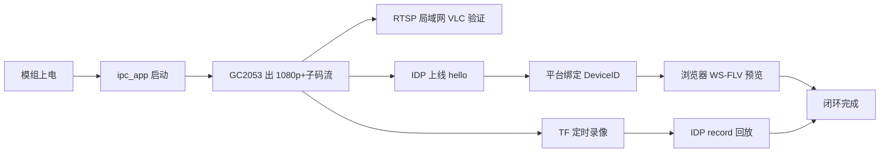

# 自研硬件基线冻结与文档排查报告（GK7205V200 + GC2053）

| 项目 | 内容 |
|---|---|
| 文档编号 | IPC-HW-BASELINE-001 |
| 版本 | v1.0 |
| 日期 | 2026-09-21 |
| 目的 | **冻结当前模组实机规格**，排查 PRD/固件/规格文档中的过时假设，给出「自研硬件闭环」最小路径 |
| 战略约束 | 先不对标 TUMS；**先把自有 IPC 样机跑通**（出流 → 上云 → 预览 → TF 回放） |
| 状态 | **实机规格 + 原理图已核对**（2026-09-21 补充 `G5V23-V1-原理图.pdf`，Hi3516EV200DMEB 同源 6 页）；镜头焦距、加密芯片型号（若非板载 EEPROM/扩展口）仍待补 |
| 原理图 | `D:\JetsCam\Source\国科微\G5V23-V1-原理图.pdf`（6 页；Power / SoC 模拟 / 接口 / Boot-Flash / 接插件 / Sensor-外设） |

---

## 1. 硬件基线（2026-09-21 冻结，以此为准）

| 项 | **实机规格** | 对文档的影响 |
|---|---|---|
| SoC | **国科微 GK7205V200**（海思 **HI3516EV200** 引脚 PIN 对 PIN 替代） | 与既有「量产 V200」一致；OpenIPC/MPP 按 EV200 兼容族 |
| Sensor | **GalaxyCore GC2053**，光学 **1/2.9"**，低照效果好 | **纠正 SC230AI**；2MP 级，主码流按 1080p 设计 |
| Flash | **16MB**（批量可换 **32MB**） | **纠正 128MB NAND 假设**；OTA/分区/控制台资源策略必须重算 |
| 网口 | **100M** 以太网 | 与 FE PHY 一致 |
| 电源 | **DC12V**，支持 **5–12V** 宽压 | 产品规格书项，固件不感知（可进外壳/电源说明） |
| USB | **1** 路（`USB_DM/DP`） | 调试/U 盘类外设 |
| PWM | 原理图 **PWM0、PWM1** 共 2 路（口述 1 路可用；PWM1 作 `LED_Ctrl`） | 红外灯调光用 PWM1 |
| RS485 | **预留**（未贴/未用） | PTZ/透传预留；R0 **不实现** RS485 协议 |
| 加密接口 | **1** 路（硬件安全元件） | 纠正「无硬加密」；IDP 设备证书/私钥优先走加密芯片 |
| TF 存储 | **可展板**贴装 TF 槽；**已安装 64GB TF 卡** | 录像/回放闭环不依赖 Flash 容量；16MB NOR 只放系统与应用 |
| DDR | 文档/芯片基线为 **V200 内置 64MB**；板级 boot 曾见 `mem=32M` 为 **Linux 可用划分**，不是总容量 | 预算仍按 64MB 芯片规格 + **以 `free`/`/proc/meminfo` 实测为准** |
| 音频 | **原理图确认有音频通路**：`AC_IN` + `AC_MICBIAS`（拾音）、`AC_OUT` / `AC_OUTL_REAR`（线路出） | **可做拾音 + 对讲下行**；能力位可开 `talk`，协议实现可后置 |
| WiFi | 清单无模组；**原理图亦无 WiFi** | **`network.wifi.enabled=false`** |
| 镜头 | 未列焦距；**有 IRCUT 电机驱** | 默认定焦 + **自动日夜 ICR** |
| 外接 ISP | 未列 | **SoC 内置 ISP**（GC2053 走 MIPI-2lane 进 SoC） |
| Flash 型号 | **U5 MX25L12835ZN**（128Mbit=**16MB** SPI NOR，8 脚） | 与 16MB 基线一致；Boot 默认 SPI NOR |
| 传感器供电 | **U7 BU12TD3WG（1.2V DVDD）+ U8 BU28TD3WG（2.8V）** | GC2053 专用 LDO，profile 不用写电源细节 |
| IRCUT | **U9 BA6208** 电机驱动 + `J4 CUTS`；注「驱动走线 ≥20mil」 | `gpio_map.ircut_*`；日夜切换硬件齐备 |
| 红外/白光灯 | `LED_Ctrl`（`GPIO1_0` / **PWM1**） | `ir_led` 用 PWM1，不是仅 PWM0 |
| 光敏 | **LSADC_CH0 / CH1**（片内光敏 ADC） | `light_sensor.adc=0/1` |
| 遥控 | `IR_IN`（`GPIO0_0` / `UPDATE_MODE` 复用） | R0 不做遥控解码，预留 |
| 485 | **U13 MAX485（可 NC）** + `485_CTRL`（经 Q 驱动）+ UART1 | 与「预留」一致：焊盘/器件位在，**协议栈 R0 不做** |
| 加密 | 原理图见 **U10 M24C02 EEPROM**（可选）；口述「加密接口×1」 | SE 芯片若在扩展口/另页需网表确认；驱动前 `hal_crypto` **文件 + EEPROM 回退** |
| 以太网 | 内置 FE PHY + 网变 **T1**，`LINK_LED`/`ACT_LED` | 100M |
| USB | `USB_DM/DP` 引出 | 1 路 |
| 存储卡 | **SDIO0** + `CARD_DETECT` + `SDIO_CARD_POWER_EN` | TF；**已插 64GB** |

```text
  12VIN ──TVS── FR9811/LP3202 ── 3V3 / 1V8 / CORE
                │
         GK7205V200（Hi3516EV200 PIN对PIN）
           │ MIPI-2lane+CK     │ FE PHY+T1      │ USB×1
           ▼                   ▼                │ UART0 调试
        GC2053              RJ45 100M          │ UART1+MAX485(可NC)
        1/2.9" 2MP          LINK/ACT LED       │ PWM0 / PWM1(LED_Ctrl)
        U7 1.2V + U8 2.8V                     │ LSADC 光敏
        U9 BA6208 → IRCUT(J4)                  │ IR_IN(复用)
           │
        SDIO0 TF 槽（可展板，已插 64GB）
        SFC SPI NOR U5 MX25L128 = 16MB（升配 32MB）
        I2C: U10 M24C02 EEPROM(可选) / 加密接口(待网表确认)
        音频: AC_IN+MICBIAS / AC_OUT+AC_OUTL_REAR
```

---

## 2. 文档排查矩阵（过时假设 → 处置）

| # | 文档 | 过时/矛盾内容 | 实机 | 严重度 | 处置 |
|---|---|---|---|---|---|
| 1 | `firmware/profiles/SP-R1-02.json` | `video.sensors: ["sc230ai"]` | **gc2053** | **阻断** | **已改** 为 `gc2053` |
| 2 | 同上 | `ota.slot_size_mb: 40` | 16MB 总 Flash **装不下双 40MB 槽** | **阻断** | **已改**：按 16MB 策略；见 §3 |
| 3 | 同上 | `network.wifi` 有 TBD 模组 + `wifi_power` GPIO | 本 SKU **无 WiFi 模组** | 高 | **已改** 关闭 WiFi |
| 4 | 同上 | `security.hw_secure: false` | 有 **加密接口** | 高 | **已改** `hw_secure: true`（驱动待接） |
| 5 | 同上 | 旧：音频未列 | **原理图有 AC_IN/OUT** | 中 | **已开** `audio.in/out` + `talk:true` |
| 6 | `SP-R1-02规格参数核对报告` | 全文 **SC230AI / 128MB NAND / 5MP** 争论 | GC2053 + 16MB NOR | **阻断（规格书）** | 核对基线改为 **GC2053**；Flash/OTA 章节重写；5MP 项维持删除 |
| 7 | `决策记录与待定事项` §2.2–2.3 | 芯片/传感器/Flash **全部待定** | 已可冻结多项 | 高 | **已改** 为「已冻结 / 仍待定」 |
| 8 | `MVP执行方案` / `私有协议方案` §4.1.4 | 默认 **WiFi ~3MB** 进预算；OTA 下载缓冲 ≥4MB | 无 WiFi 可省；16MB Flash OTA 缓冲策略变 | 中 | 预算重算：去掉 WiFi；OTA 改「边下边写 Flash」 |
| 9 | `IPC固件平台化架构` | 示例 sensor `sc230ai`；Flash 16MB 标「低配」 | 16MB 为 **量产默认**，32MB 为升配 | 中 | 架构仍有效；示例名过时，以 profile 为准 |
| 10 | `MVP-R0切片规格` | 「硬件不在 R0 冻结」 | 本报告 **给出 R0 硬件基线** | 低 | 闭环验收增加「真机 GC2053 出画」 |
| 11 | `gk_sys.c` / mock | mock `flash_total_kb=128*1024`；注释「无温度」 | 16MB Flash | 低 | mock 可后改；真机 `get_info` 读 MTD/partition |
| 12 | `gk_crypto.c` | 「无硬件安全存储」文件代替 | 有加密接口 | 中 | **保留文件回退**；有芯片时走 `hal_crypto` 硬件路径 |
| 13 | `gk_stub.c` video | 全 `HAL_ENOTSUP` | 需 **GC2053 出流** | **闭环阻断** | 下一里程碑：`hal_video` 真实现 |
| 14 | 平台 PRD / 接入规范 | 传感器/Flash 无细表 | — | 低 | 不改；硬件细节不进云 PRD |

**结论**：文档体系**结构可用**，但 **Sensor 与 Flash 两处基线错误**会直接导致调优资产找错、OTA 装不下、规格书无法签字。其余为预算与能力开关问题。

---

## 3. Flash 16MB 与 OTA 策略（必须改设计）

### 3.1 问题

| 旧假设 | 实机 |
|---|---|
| SPI NAND **128MB**，OTA A/B 双槽各 **40MB** | SPI NOR **16MB**（升配 32MB） |

16MB 物理上 **不可能** 双 40MB 槽；`profiles` 中 `ota.ab + slot_size_mb:40` 与板级 `spi_image` 单 rootfs 现状一致——量产必须换策略。

### 3.2 推荐分区（16MB 量产默认）

| 分区 | 建议大小 | 说明 |
|---|---|---|
| bootloader | 256–512KB | 现有 uboot |
| kernel (uImage) | 2.5–3.5MB | Linux 4.9.37 |
| rootfs (jffs2/ubifs) | 8–10MB | **含 `ipc_app` + 压缩控制台资源**；升级以 **整 rootfs 或 app 更新包** 为主 |
| config / sec | 256–512KB | 配置 + 加密芯片外的文件回退区（密钥优先在加密芯片） |
| recovery/预留 | 余量 | 失败回滚或日志 |

**32MB 升配**：可启用 **A/B rootfs 双槽**（各约 12–14MB），恢复体验更好；**同一固件源**，profile/`hal_sys` 按探测到的 Flash 容量选策略。

### 3.3 OTA 能力分级（写入能力位 `ota`）

| 级别 | Flash | 行为 | R0 闭环 |
|---|---|---|---|
| L0 串口/烧录器 | 16MB | 开发期刷机 | **足够跑通闭环** |
| L1 应用/整包单槽升级 | 16MB | 下载到 TF 或 tmp → 校验 → 写入 rootfs/app → 重启；**失败靠串口/本地恢复** | R0 建议做到「能远程刷」 |
| L2 A/B 无回滚风险 | **32MB** | 双槽 + `ota_confirm` | R1/量产升配 |

**明确**：16MB **不承诺** 无感 A/B；文档与销售口径禁止再写「40MB 双分区」。

### 3.4 控制台与协议体积

- 控制台继续 **gzip 嵌入**（`gen_assets.py` 方向正确）；16MB 下优先 **单页精简控制台**，完整云控由 IpcCloud 平台承担。
- 四协议并存时优先 **.so 按需加载**（接入方案裁剪顺序 ⑤），给 rootfs 留白。

---

## 4. 与 GC2053 相关的规格口径（规格书/PRD 对外）

| 项 | 建议对外写法 | 禁止写法 |
|---|---|---|
| 传感器 | GC2053，1/2.9" 2MP，低照优化 | SC230AI；1/2.7" |
| 有效像素 | 1920×1080 | 2880×1620 / 2592×1944 |
| 主码流 | 1920×1080，H.265/H.264 | 5MP / 3MP |
| 次码流 | 640×360 或 704×396 | 704×576 变形 4:3 |
| 宽动态 | 以 GC2053 + GK ISP 实测为准（默认「支持 WDR/低照」待测） | 写死 >100dB 不测 |
| 最低照度 | **样机实测**后写数（卖点：低照好） | 抄 SC230AI 的 0.05Lux |
| 对讲 | **支持拾音 + 音频出**（`AC_IN`/`AC_OUT`，外接喇叭/功放） | 无原理图依据时写「无音频」 |
| WiFi | **本版无**（以太网接入） | 写 802.11 |
| 安全 | **硬件加密接口** + 凭据保护 | 「无安全芯片」 |

---

## 5. 自研硬件闭环路径（先跑通，不扩 TUMS）

目标一句话：**样机上电 → 出 RTSP/IDP 流 → IpcCloud 首绑归属 → 浏览器预览 → TF 录像回放**（Reset 可夺回再绑）。



### 5.1 里程碑（建议 2–3 周）

| 序 | 工作 | 退出标准 | 依赖 |
|---|---|---|---|
| H1 | 文档/profile 按本报告对齐 | profile 校验过；决策记录无「芯片待定」 | **本报告** |
| H2 | `platform/gk7205v200` **video 真实现**（MPP/ISP + GC2053） | 双码流 24h 稳定；`ffprobe` 参数正确 | GOKE SDK / 驱动 |
| H3 | 局域网 RTSP | VLC/ZLM 拉主/子码流 | H2 |
| H4 | Flash 镜像可烧录 + `ipc_app` 自启 | 网页 ` /api/v1/system/info` 返回真机信息 | 现有控制台落地工作 |
| H5 | IDP 接入闭环 | hello/鉴权/心跳；平台列表 online | 证书进加密芯片或文件回退 |
| H6 | 平台预览 | h265web 首帧 ≤1.5s（局域网） | H5 + ZLM |
| H7 | TF 录像 + `record.query/play` | **64GB 卡**时间轴有段；循环覆盖/索引正确；拖动出画 | H2 + storage（**卡已就位**） |
| H8 | 加密芯片接入 | 私钥不可读导出；签名/随机可用 | 芯片型号/驱动 |
| H9 | 16MB 单槽升级包 | 远程升级一次成功（可串口兜底） | H4 |

**R0 闭环 = H1–H7**；H8/H9 可并行，不阻塞首次「能看能回放」。  
**录像依赖已解除**：TF 槽经可展板贴装且 **64GB 卡已装**，H7 可直接开测（建议 exFAT；定时/事件录像 ≥72h）。

### 5.2 立刻可做的代码/配置动作

1. 使用已改 `SP-R1-02.json`（gc2053 / 无 WiFi / hw_secure / 16MB OTA 策略）。  
2. `gk_stub.c` 的 `v_probe_sensor` 返回 `gc2053`；`hal_video` 按 MPP 实现。  
3. `gk_crypto.c`：保留文件回退，增加加密芯片分支（型号确认后）。  
4. 镜像脚本按 §3.2 分区；**删除 40MB slot 文档表述**。  
5. 真机 `free` 记入《SP-R1-02》实测表（区分「芯片 64MB」与「Linux 可用」）。

---

## 6. 仍待硬件补全（不阻塞 H1–H5）

| 项 | 为何还要 | 建议 |
|---|---|---|
| 加密芯片/接口确切器件（原理图见 M24C02；口述加密接口待网表） | 驱动与证书灌装 | 未定则 H5 文件证书 + EEPROM 可选 |
| 音频输入有无 / 功放 | 是否保留 MIC 产品点 | 无则规格书删音频 |
| 镜头定焦焦距（2.8/4/6mm） | 最低照度与 FOV 标称 | BOM 表 |
| 外接 ISP 有无 | 调优资产归属 | 模组原理图一栏 |
| TF 卡槽是否贴装 / 最大容量 | ~~录像闭环~~ **已确认（2026-09-21）**：经**可展板**贴装 TF 槽，**已插 64GB TF 卡** | 录像闭环可用；量产标称容量仍以实测/供应商为准 |
| PWM 占用（IR LED vs 其他） | `gpio_map` 引脚号 | 原理图网表 |
| RS485 是否预留电平芯片 | 仅预留焊盘则 PTZ 不做 | R0 忽略 |

---

## 7. 回写清单（本报告落地时已/应修改）

| 文件 | 动作 |
|---|---|
| `firmware/profiles/SP-R1-02.json` | **已更新**：gc2053、16MB OTA 策略、关 WiFi、hw_secure |
| `Docs/PRD/决策记录与待定事项.md` | **应更新** §2.2–2.3 冻结项 |
| `Docs/PRD/SP-R1-02规格参数核对报告.md` | 下一版改基线为 GC2053 + 16MB NOR（本报告可作附录） |
| `Docs/PRD/MVP-R0切片规格_一页纸.md` | 验收剧本增加「真机 GC2053 出画」 |
| `firmware/platform/gk7205v200/*` | H2 起实现 video；crypto 加 SE 分支 |
| 核对报告 §4 建议稿 / 对外规格书 | 按 §4 口径改传感器与 Flash |

---

**一句话**：硬件已经能定基线了——**GK7205V200 + GC2053 + 16MB NOR + 硬件加密口**；文档里最大的坑是 **传感器写错** 和 **Flash/OTA 按 128MB 假设设计**。先改 profile 与规格口径，再按 H1–H7 把自研机闭环跑通，TUMS 对标放到闭环之后。

---

## 8. 插 TF 卡上电启动异常排查（2026-09-28，依据《GK7205V200 硬件设计用户指南》）

**现象（用户实测）**：插入 SD 卡 → 给摄像头模组**上电** → 串口不正常；拔掉 SD 卡 → 再次上电 → 串口正常。

**依据文档**（`D:\JetsCam\Source\国科微\GK7205V200_7205V300_7605V100\...\GK7205V200 硬件设计用户指南.pdf`）：

| 条款 | 关键内容 |
|---|---|
| §1.1.4 表1-2 `UPDATE_MODE`（pin72 = `GPIO0_0/UPDATE_MODE/IR_IN`） | **0=使能 SDIO0 及 USB 烧写；1=禁用**。使能后 `BOOT_SEL/SFC_DEVICE_MODE` 指定的启动方式**不生效**，**上电时检测 SDIO0 是否有 SD 卡**，**有卡就把卡里的 boot 烧写进启动介质** |
| §1.1.4 注 | 配置管脚**部分与 LCD、SDIO、SFC 复用**，与外设相连时**必须**加上下拉固定初始态：`BOOT_SEL1/SFC_INPUT_SEL/SFC_DEVICE_MODE` 上拉推荐 1kΩ、其余上拉 10kΩ、**下拉统一 4.7kΩ** |
| §1.3.4 表1-11 | `SDIO0_CCLK_OUT` SoC 端串阻 51Ω(2层)/22Ω(4层)；`SDIO0_CDATA[0:3]`/`CMD` **47K 上拉**；**`SDIO0_CARD_DETECT` 板级 100K 上拉到 3.3V**；SDIO0 电平必须与 SFC（Flash）供电一致 |
| §1.5 表1-16 | VDD 上电 600~700mV 阶段部分 IO **概率性毛刺**（30mV~3.3V、10~150us），名单含 **pin19 `LCD_CLK/GPIO8_7/BOOT_SEL1`**、**pin22 `LCD_DE/GPIO8_4/BOOT_SEL0`**（正是启动源配置脚） |
| §1.1.2 | 存放 boot 的 Flash 等小系统外设**必须先于或同时**与 SoC 释放复位，否则可能无法启动 |

**本机实测（2026-09-28，串口 + 只读寄存器）**：

- 启动链路上 **U-Boot / 内核都不会去碰 SD 卡**，因此「串口异常」不可能出在它们：
  - U-Boot `bootcmd=sf probe 0;sf read 0x41000000 0x100000 0x500000;bootm 0x41000000`、`bootdelay=1`，**纯 SPI NOR 启动**；`mmc list / mmc rescan / mmc info` 全部回 `No MMC device available`，启动横幅 `MMC:` 为空。
  - 内核 `mmc0`(SDIO0@0x10010000) **从未发出一条 SD 命令**：`/proc/interrupts` mmc0=0（mmc1=56）、`INT_STATUS=0`、电源控制字节=0、卡时钟关；`/dev/mmcblk*` 不存在。
- **带「卡在位」的热重启（reboot）串口完全正常**：ROM → U-Boot → 内核 → shell 一路无异常；`SDHCI PRESENT_STATE=0x03120000`（bit16 `SDHCI_CARD_PRESENT`=1，CMD/DAT0 为高）。
- 读到的配置脚电平（**注意：这些脚上电后已切到复用功能，读值≠ROM 上电采样值**）：`UPDATE_MODE`(GPIO0_0)=1=已禁用烧写、`SFC_INPUT_SEL`(GPIO4_0)=0、`BOOT_SEL0`(GPIO8_4)=0、`BOOT_SEL1`(GPIO8_7)=1。
- 原理图（`G5V23-V1-原理图.pdf`）：TF 走 **J25 = FPC-0P5-12P**（脚位 1 CLK / 2–5 DATA0-3 / **6 SDIO_CARD_POWER_EN** / **7 SDIO0_CARD_DETECT** / 8 CMD / 9-10 GPIO8_5、8_6 / 11-12 3V3），**J7 是 4P USB 排针（3V3/D−/D+/GND，NC）**；`SFC_FUNCTION_SELECT: 0:SFC; 1:SDIO1`，`SFC_INPUT_SEL` 由 **R29=1K** 固定，`UPDATE_MODE` 只有内部上拉（图注 `UPDATE_MODE is internal pull up`，表列 `1=Disable(default)`）。**原理图中未见 100K(CD)/47K(CDATA、CMD) 上拉**——这类"板级预留"可能在可展板上，需核对。

**结论（按可能性排序）**：

1. **`UPDATE_MODE` 在上电爬升期被拉成 0** → ROM 上电即扫 SDIO0，**有卡就进入"从 SD 卡烧写 boot"流程**（表1-2 注），串口因此长时间无正常输出；拔卡则跳过 → 正常。内部上拉较弱，pin72 又兼作 `IR_IN`，若板上有红外/排线/测试点，必须外加 10kΩ 上拉。
2. **启动源配置脚与 SDIO 复用、板上缺外部上下拉**：`SFC_INPUT_SEL` 就在 **pin57 = `SDIO0_CCLK_OUT`** 上——插卡会给这条 strap 线加负载/钳位，上电采样被带偏 → 落到 `010/110`（FAST BOOT 串口烧写）等模式 → 串口停在等待烧写状态。§1.5 的上电毛刺名单又包含 `BOOT_SEL0/1`，会加剧采样不稳。
3. **电源/复位时序**：TF 座 3.3V 常供电，插卡后上电浪涌 → 触发 §1.5 毛刺或 §1.1.2 复位时序问题 → 串口乱码/不起机。

**调整配置（整改清单）**：

| # | 位置 | 动作 | 依据 |
|---|---|---|---|
| 1 | pin72 `UPDATE_MODE` | 加 **10kΩ 上拉到 3.3V**（确保恒为 1=禁用 SD/USB 烧写）；若要保留 IR_IN 功能，改接法使上电采样不受影响 | §1.1.4 表1-2、上拉 10kΩ 推荐 |
| 2 | pin57 `SFC_INPUT_SEL`（=SDIO0_CCLK） | 确认 R29 极性并按文档固定初始态（下拉统一 4.7kΩ、上拉 1kΩ），电阻紧靠 SoC 且在 CCLK 串阻内侧；**保证插拔卡不改变该脚电平** | §1.1.4 注 |
| 3 | pin61 `SDIO0_CARD_DETECT` | 补 **100kΩ 上拉到 3.3V**（现未见） | §1.3.4 表1-11 |
| 4 | `SDIO0_CDATA[0:3]`/`CMD`/`CCLK` | 补 47K 上拉；CCLK SoC 端串 51Ω(2层)/22Ω(4层) | §1.3.4 表1-11 |
| 5 | pin19/22 `BOOT_SEL1/BOOT_SEL0` | 外部各加 4.7kΩ 下拉（内部下拉 + 上电毛刺名单内，建议外部加固） | §1.1.4 注、§1.5 表1-16 |
| 6 | TF 座 3.3V | 核对与 SoC 3.3V 同轨/软启动，避免插卡浪涌压降 | §1.1.2、§1.5 |
| 7 | 内核 DTS（软件，待确认） | `mmc0` 节点补 `cd-gpios`（GPIO4_7 低有效，配合 #3），或本阶段先 `status="disabled"`；**需重烧 5M kernel 分区** | 本次实测：CD 读值不稳、内核从不扫描 |
| 8 | U-Boot（无需改） | `bootcmd` 已纯 SPI NOR、`bootdelay=1`，无 SD 分支 | 本次实测 |

**冷上电实测复现（2026-09-28 晚，插卡 + 彻底断电再上电 ×4）**：

- 4 次上电，串口**每次都只输出一行 25 个空格就彻底沉默**，**没有 `System startup`、没有 `U-Boot`、没有内核日志**（`cold_boot.log` 共 156 字节 = 4×`"                         \n"`）。
- 正常启动的字节序列基线是 `…Restarting system\r\n` + `"<25 空格>\n"` + `\r\n\r\n` + `System startup\r\n\r\nUncompress Ok!\r\n\r\nU-Boot 2016.11 …` → **4 次全部断在「ROM 输出第一行之后、`System startup` 之前」**。
- 结论：**ROM 已经跑起来、UART 正常**（所以不是"电源没起来/串口乱码"），**U-Boot 与内核根本没被执行** → 卡点在 **ROM 的启动介质选择 / SD 扫描阶段**，且拔卡冷上电正常、插卡 4/4 必现 → **确定性分叉，不是概率性毛刺**。
- 插卡冷上电起来后（第 5 次成功）补充读数：`uptime` 起来时 `/proc/interrupts` **mmc0 由历次的 0 变成 1**（ROM/内核确实碰过一次 SDIO0），但**仍无 `/dev/mmcblk*`、卡电源始终为 0**（卡从未被真正上电初始化）。
- 据此把 §8 整改重点收敛为：**#1（pin72 `UPDATE_MODE` 10kΩ 上拉，保证上电采样恒为 1=禁用 SD/USB 烧写）为必做项**，其次 #2（`SFC_INPUT_SEL` 1K 下拉到位）、#3（CD 100kΩ 上拉）。**最快的确诊手段**：在 pin72 飞线 10kΩ 上拉到 3.3V 后插卡冷上电 —— 若恢复正常即确诊机理①；若仍卡住，则用示波器看 pin57 `SFC_INPUT_SEL` 与 pin72 上电波形（机理②）。

**软件侧整改落地 + 热插卡实测（2026-09-28 晚）**：

- **内核 DTS 已改并烧写**：`gk7205v200-demb.dts` 的 `&mmc0` 增加 `cd-gpios = <&gpio_chip4 7 1>`（pin61 = GPIO4_7，低有效）与 `disable-wp`（TF 无写保护开关，配合 `SDHCI_QUIRK_INVERTED_WRITE_PROTECT` 否则会把卡判成只读）。补丁/构建脚本入库：`firmware/docker/scripts/patch-mmc-cd-gpio.sh`、`build-kernel.sh`；烧写用新增的 `board.py reflash-kernel`（带「拒绝擦写 0x0」护栏）。**板上原内核已完整备份**：`docker/out/gk7205v200/spi_image/uImage_gk7205v200.board-backup`（5MB，含 uImage 头校验），回滚一条命令。
- **生效证据**：`uname -a` → `4.9.37 #2 Sep 28 2026`（本方构建）；`/proc/device-tree/soc/sdhci@0x10010000/` 含 `cd-gpios`、`disable-wp`；`dmesg` 有 `sdhci-goke 10010000.sdhci: Got CD GPIO`；`echo 39 > /sys/class/gpio/export` 报 `Device or resource busy`（GPIO4_7 已被内核占用）。**热插卡后 mmc0 中断 55 → 2854**，说明内核确实在扫卡（旧内核恒为 0）。
- **但仍然枚举失败**（无 `/dev/mmcblk0`、无挂载），日志三段：
  1. `mmc0: Timeout waiting for hardware cmd interrupt.` ×9 + `REGISTER DUMP`（`Cmd: 0x0000371a` = CMD55 卡在等响应、`Timeout: 0x00000000`、`Power: 0x0E`=3.3V 但未上电态）；
  2. `no support for card's volts` → `error -22`（`mmc_select_voltage()`：OCR `&= host->ocr_avail` 后为 0，**卡返回的 OCR 是垃圾值**）；
  3. `card claims to support voltages below defined range` + `error -84 (EILSEQ)`/`-110 (ETIMEDOUT)`；`Host ctl2: 0x88` 说明垃圾 OCR 还把驱动骗去做了 **1.8V 电平切换**。
- **推断**：内核已按 `freqs[] = 400k/300k/200k/100kHz` 全频段试过仍失败 → **排除"速率过高"**；CMD 有部分响应但 CRC/内容错乱 → 指向 **CMD/DATA 上拉缺失（表1-11 要求 47K）、CCLK 串阻/走线（≤5inch）、卡槽供电（`SDIO_CARD_POWER_EN`）、或卡本身损坏**，即整改 #4/#6 与换卡验证。软件侧已无可再调的关键项（`no-1-8-v` 只能挡住被垃圾 OCR 触发的 1.8V 切换，治标）。
